# 新聞收集與問答系統

[](https://www.python.org/downloads/release/python-390/)
[](https://github.com/psf/black)
[](https://opensource.org/licenses/MIT)

一個功能全面的新聞爬蟲與知識管理平台，預計整合 RAG 技術支援在地化中文問答。

## 目錄

* [背景](#背景)
* [功能](#功能)
* [系統架構](#系統架構)
* [技術堆疊](#技術堆疊)
* [資料夾架構](#資料夾架構)
* [API 端點](#api-端點)
* [安裝與設定](#安裝與設定)
  * [開發環境](#開發環境)
  * [生產環境](#生產環境)
* [使用範例](#使用範例)
  * [爬蟲管理](#爬蟲管理-範例)
  * [任務管理](#任務管理-範例)
  * [文章查詢](#文章查詢-範例)
* [測試案例](#測試案例)
* [佈署指南](#佈署指南)
* [貢獻](#貢獻)
* [維護者](#維護者)
* [如何新增爬蟲](#如何新增爬蟲)
* [授權條款](#授權條款)

## 背景

### 願景與目標

* **願景:** 打造一個功能全面的新聞爬蟲與知識管理平台，整合 RAG 技術支援在地化中文問答[**規劃建置中**]。
* **目標用戶:** 個人用戶（技術愛好者/研究者）、小型團隊。
* **適用場景:** 個人新聞訂閱、技術趨勢研究、NLP 數據集構建、領域知識問答。

## 功能

### 核心功能

1. **爬蟲管理**
   * ✅ 從資料庫讀取爬蟲資料，提供列表展示。
   * ✅ 支援新增爬蟲設定。
   * ✅ 支援修改爬蟲設定。
   * ✅ 支援刪除爬蟲設定。
   * ✅ 提供測試爬蟲功能，並透過 WebSocket 顯示進度。
2. **任務管理**
   * ✅ 從資料庫讀取任務列表。
   * ✅ 支援新增任務 。
   * ✅ 支援修改任務。
   * ✅ 支援刪除任務 。
   * ✅ **自動爬取設定:**
     * ✅ 設定任務名稱、選擇爬蟲、設定爬取週期 (Cron 表達式) 。
     * ✅ 設定是否只收集 AI 相關資料。
     * ✅ 設定備註。
   * ✅ **手動爬取:**
     * ✅ 提供按鈕手動觸發任務執行。
     * ✅ 提供任務取消功能。
     * ✅ 透過 WebSocket 顯示爬取進度 (連結階段/內容階段)**[進度回報機制改善中]** 。
     * ✅ 針對特定手動模式，提供抓取連結後，讓使用者勾選目標連結再爬取完整內容的功能 。
     * ✅ 支援多種爬取模式（如僅連結、完整內容）及限制文章數量 。
3. **資料展示**
   * ✅ 提供文章列表和篩選。
   * ✅ 提供搜尋功能 。
   * ✅ 文章列表展示欄位：ID, 標題 (Title), 來源 (Source), 發布時間 (Published At), 是否 AI 相關 (is\_ai\_related), 最後爬取時間 (Last Scrape Attempt), 爬取狀態 (Scrape Status)。
   * ✅ 提供文章詳細頁面跳轉或快速查看模態框。
4. **資料轉換 (規劃中)**
   *  將爬取資料轉為領域資料庫，支援 RAG 應用 (尚待實作)。
   *  提供轉換任務查看功能 (尚待實作)。
5. **問答對話 (規劃中)**
   *  整合 RAG 技術與在地模型，根據領域資料庫回答中文問題 (尚待實作)。
6. **基礎功能**
   * ✅ 使用 Flask 網頁介面。
   * ✅ 透過 API 與後端互動。
   * ✅ 使用 WebSocket 進行即時狀態更新。
   * ✅ 使用 PostgreSQL 資料庫。
   * ✅ 使用 Git 與 Docker Compose 進行管理與部署。

### 未來擴展功能

* 主題過濾：根據關鍵詞或標籤篩選文章。
* 通知系統：新文章到達時通過電子郵件或 RSS 通知。

## 未來擴展藍圖 (Future Expansion Roadmap)

本節概述了系統未來的發展方向和技術規劃，旨在將系統從新聞收集平台擴展為一個整合 RAG 技術的智能知識問答系統。

### 1. 資料轉換引擎 (Data Transformation Engine)

*   **目標:** 將已爬取、清洗過的新聞文章轉換並儲存到適合 RAG (Retrieval-Augmented Generation) 應用的向量資料庫中。
*   **功能規劃:**
    *   **文章分塊 (Chunking):** 將長篇文章切分成較小的、語意完整的文本塊，以便進行有效的向量嵌入。
        *   *規劃技術:* LangChain 的 `RecursiveCharacterTextSplitter` 或類似的文本分割工具，可根據語意邊界（如段落）進行分割。
    *   **向量嵌入 (Embedding):** 使用嵌入模型將文本塊轉換為向量表示。
        *   *規劃技術:* **m3e-base** (中文優化嵌入模型)，透過 `sentence-transformers` 或 LangChain 的 `HuggingFaceEmbeddings` 整合。
    *   **向量儲存 (Vector Storage):** 將文本塊及其向量儲存到向量資料庫中，並包含原文連結、來源等元數據 (Metadata)。
        *   *規劃技術:* **Chroma** (輕量級、易於本地部署)，可透過 LangChain 的 `Chroma` 整合。
    *   **轉換任務管理:**
        *   提供 Web UI 介面，用於觸發、監控和管理資料轉換任務 (例如，轉換特定時間範圍或來源的文章)。
        *   顯示轉換進度、成功/失敗的文本塊數量等資訊。
        *   *規劃實現:* 類似現有的爬蟲任務管理，使用獨立的背景任務 (如 Celery 或 APScheduler) 執行轉換，並透過 WebSocket 更新前端狀態。需要新的資料庫模型來追蹤轉換任務狀態。

### 2. 智能問答對話系統 (Intelligent Q&A System)

*   **目標:** 基於已轉換的領域知識庫（向量資料庫），整合大型語言模型 (LLM) 提供中文問答能力。
*   **功能規劃:**
    *   **RAG 核心實現:**
        *   接收使用者問題。
        *   將問題轉換為向量。
        *   在向量資料庫中搜尋與問題向量最相關的文本塊 (上下文)。
        *   將原始問題和檢索到的上下文組合成提示 (Prompt)。
        *   將提示傳送給大型語言模型 (LLM) 生成答案。
        *   *規劃技術:* LangChain 提供完整的 RAG 鏈 (`RetrievalQA`) 實現框架，可整合向量資料庫 (Chroma)、嵌入模型 (m3e-base) 和 LLM (ChatGLM-6B)。
        *   **詳細流程:** 使用 LangChain 的 `RecursiveCharacterTextSplitter` 進行文本分塊，設定適當的塊大小 (約 1000 字元) 和重疊區域 (100 字元)；使用 `m3e-base` 模型將問題和文本塊轉換為向量；使用向量數據庫的相似度搜尋功能找出最相關的 3-5 個文本塊；將原始問題和這些文本塊組合成 prompt，指示模型根據提供的上下文回答問題；最後將 prompt 傳給模型生成答案。
    *   **在地大型語言模型 (Local LLM) 整合:**
        *   整合開源的中文大型語言模型進行答案生成，確保資料私密性。
        *   *規劃技術:* **ChatGLM-6B** (或其更新版本)。需要研究如何高效部署和調用此模型，可能需要獨立的 GPU 伺服器或使用 Ollama、vLLM 等工具進行本地部署和 API 封裝。
        *   **模型選擇考量:** 選擇 ChatGLM-6B 作為主要模型是基於其在中文處理能力和硬體需求的平衡考量。ChatGLM-6B 作為一個 60 億參數的模型，可以在具有 8GB 顯存的 GPU 上運行，同時具有良好的中文理解和生成能力。也考慮了 BLOOMZ-7B1-mt 和 Qwen-7B 等替代選項，這些模型在特定任務上可能有優勢，但綜合考慮資源需求和中文處理能力後，ChatGLM-6B 是較為平衡的選擇。未來也會評估 ChatGLM2-6B 或 Qwen1.5-7B 等新模型。
    *   **問答介面:**
        *   **自由問答:** 提供一個類似聊天機器人的介面，讓使用者自由輸入問題。
        *   **預設問答模板:** 提供針對常見問題（如 "最近 AI 有哪些重要新聞？", "某某技術的最新進展是什麼？"）的按鈕或選項，簡化使用者操作。
        *   **答案來源追溯:** 在生成的答案旁顯示參考的原始文章連結，增加可信度。
        *   *規劃實現:* 使用 Flask-SocketIO 實現即時的問答互動，前端使用 JavaScript 處理使用者輸入和顯示結果。

### 3. 新聞速報儀表板 (News Dashboard)

*   **目標:** 提供一個視覺化的儀表板，快速概覽近期新聞熱點和趨勢。
*   **功能規劃:**
    *   **新聞詞雲 (Word Cloud):** 分析近期 (如過去 24 小時或 7 天) 文章標題或內容，生成詞雲圖，突顯熱門關鍵詞。
        *   *規劃技術:* 使用 `jieba` 進行中文分詞，`wordcloud` 庫生成詞雲圖。可在後端定期生成圖片，或前端使用 JavaScript 詞雲庫 (如 `wordcloud2.js`)。
    *   **條列摘要 (Bulleted Summaries):** 對於特定主題或來源的最新文章，自動生成簡短的條列式摘要。
        *   *規劃技術:* 可以利用整合的 LLM (如 ChatGLM-6B) 進行摘要生成，或者使用傳統的抽取式摘要算法 (如 TextRank)。
    *   **關鍵字相關文章連結 (Related Articles by Keyword):** 點擊詞雲中的關鍵字或選擇特定主題，快速連結到包含該關鍵字的相關文章列表。
        *   *規劃實現:* 擴展現有的文章搜尋功能，或在資料轉換階段建立關鍵字索引。

## 系統架構

以下是本系統的架構圖：

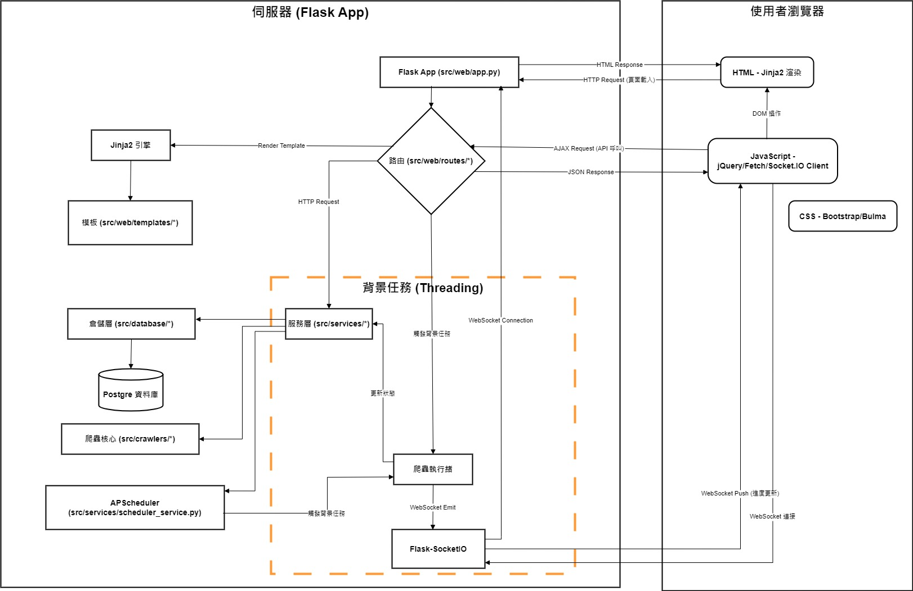

### 設計考量

本系統採用了常見的分層架構模式，特別是在資料處理方面，以提高模組化、可測試性和可維護性。關鍵的分層如下：

1.  **`src/models` (資料模型層):**
    *   **職責:** 定義應用程式的資料結構。
    *   **內容:** 包含兩種類型的模型：
        *   **SQLAlchemy 模型 (繼承自 `database.base_model.Base`):** 用於定義資料庫表格的結構、欄位和關聯性。這些模型由 SQLAlchemy ORM 用於與資料庫互動。
        *   **Pydantic 模型 (繼承自 `pydantic.BaseModel` 或 `base_schema.BaseSchema`):** 主要用於 API 的請求/回應資料驗證、序列化/反序列化，以及在不同服務層之間傳遞結構化資料。它們確保了資料在系統內部流動時的格式一致性和有效性。
    *   **範例:** `ArticlesModel` (SQLAlchemy), `ArticleCreateSchema` (Pydantic)。

2.  **`src/database` (資料存取層 - Repository 模式):**
    *   **職責:** 封裝所有與資料庫直接互動的邏輯 (CRUD - Create, Read, Update, Delete)。
    *   **內容:** 包含 Repository 類別，每個類別通常對應一個 SQLAlchemy 模型。Repository 方法接收或返回 Pydantic 模型或 SQLAlchemy 模型實例，內部則使用 SQLAlchemy Session 執行資料庫操作。
    *   **目的:** 將資料庫查詢邏輯與業務邏輯分離，使得更換資料庫或修改查詢方式時，對上層服務的影響最小化。它提供了一個清晰的介面來存取特定類型的資料。
    *   **範例:** `ArticlesRepository` 提供了新增、查詢、更新、刪除 `ArticlesModel` 的方法。

3.  **`src/crawlers` (爬蟲層):**
    *   **職責:** 提供爬取各種新聞網站的爬蟲實作及其基礎架構。
    *   **內容:** 以多層次結構組織：
        *   **基礎架構類別 (`BaseCrawler`):** 定義了爬蟲操作的抽象流程和通用方法，包括任務進度管理、重試機制、錯誤處理等。提供模板方法模式，讓子類實作特定的爬取邏輯。
        *   **工廠類別 (`CrawlerFactory`):** 負責根據資料庫中的爬蟲設定，動態載入和初始化爬蟲實例。實現了控制反轉，使系統能夠在不修改核心程式碼的情況下擴展支援新的爬蟲類型。
        *   **特定網站爬蟲 (如 `BnextCrawler`):** 繼承自 `BaseCrawler`，實作特定網站的爬取邏輯。通常會劃分為列表爬取器和內容擷取器兩個組件，以分離關注點。
        *   **分析工具 (`ArticleAnalyzer`):** 提供文本分析功能，如關鍵字提取、AI 相關性判斷等。
        *   **配置管理 (`configs/`):** 使用 JSON 檔案存儲各網站的爬蟲配置，包括選擇器、URL 模板等。
    *   **目的:** 透過抽象基類和工廠模式，提供一個可擴展的架構，使添加新網站爬蟲變得簡單。同時，進度報告和錯誤處理等橫切關注點被統一處理。
    *   **範例:** `BnextCrawler` 組合了 `BnextScraper`（列表爬取）和 `BnextContentExtractor`（內容擷取）兩個組件，實現了對明日科技網站的爬取。

4.  **`src/services` (服務層/業務邏輯層):**
    *   **職責:** 實現應用程式的核心業務邏輯和工作流程。
    *   **內容:** 包含 Service 類別。服務層會協調不同的操作，例如：接收來自 API 層的請求 (通常是 Pydantic 模型)，調用一個或多個 Repository 方法來存取或修改資料，執行業務規則計算或轉換，最後可能返回結果 (通常也是 Pydantic 模型) 給 API 層。
    *   **目的:** 保持業務邏輯的集中和獨立性。使得 API 層 (Web 路由) 更輕量，只負責處理 HTTP 請求和回應，而將複雜的邏輯委派給服務層。
    *   **範例:** `ArticleService` 可能包含一個 `create_article` 方法，該方法會接收 Pydantic 的 `ArticleCreateSchema`，調用 `ArticlesRepository.add()` 來儲存文章，並可能執行一些額外的驗證或處理。

**其他值得注意的設計:**

*   **依賴注入 (Dependency Injection):** 雖然沒有明確使用框架，但透過將 Repository 實例傳遞給 Service 的建構子 (或方法)，實現了基本的依賴注入概念，提高了可測試性 (可以 mock Repository)。(參見 `service_container.py` 的應用方式)
*   **錯誤處理 (`src/error`):** 定義了自訂的錯誤類別和處理機制，以提供更一致和友好的錯誤回饋。
*   **介面定義 (`src/interface`):** 定義了如 `ProgressListener` 和 `ProgressReporter` 等抽象介面，實現觀察者模式來處理爬蟲進度回報，確保不同實作遵循一致的合約。`ProgressListener` 為抽象類別，定義了 `on_progress_update` 方法用於接收任務進度更新；`ProgressReporter` 則管理多個監聽者，並提供添加、移除、清除監聽者和通知進度等功能。

這種分層設計使得系統各部分的職責更加清晰，降低了耦合度，有利於團隊協作和長期維護。

## 技術堆疊

* **程式語言:** Python 3.9
* **後端框架:** Flask (with Jinja2), Gunicorn
* **前端技術:** HTML, CSS, JavaScript (AJAX with jQuery/Fetch), Socket.IO Client (for WebSockets)
* **資料庫:** PostgreSQL 15, SQLAlchemy, Psycopg2, Alembic
* **容器化:** Docker, Docker Compose
* **核心庫:** Requests, Beautiful Soup 4, Pandas, NumPy, APScheduler, Schedule, Flask-SocketIO, Pydantic, python-dotenv
* **開發/測試:** Pytest, Pylint, Black, isort, Coverage
* **開發環境:** VS Code Dev Containers

## 資料夾架構

```
.
├── .devcontainer/       # VS Code 開發容器設定
├── .github/             # GitHub Actions 工作流程 (CI/CD)
├── data/                # 爬蟲配置檔案、持久化資料
│   └── web_site_configs/ # 網站爬蟲設定檔
├── docker/              # 其他 Docker 相關設定 (例如 Nginx)
├── logs/                # 應用程式日誌
├── migrations/          # Alembic 資料庫遷移腳本
├── src/                 # 核心原始碼
│   ├── config/          # 應用程式配置管理
│   ├── crawlers/        # 各種新聞網站的爬蟲實作
│   ├── database/        # 資料庫模型 (SQLAlchemy) 和連線設定
│   ├── error/           # 自訂錯誤處理
│   ├── interface/       # 定義抽象介面 (例如爬蟲介面)
│   ├── models/          # Pydantic 資料模型 (API 請求/回應)
│   ├── services/        # 業務邏輯服務 (例如任務管理、爬蟲執行)
│   ├── utils/           # 通用工具函數
│   └── web/             # Flask Web 應用程式
│       ├── api/         # API 藍圖 (Blueprints)
│       ├── static/      # 靜態檔案 (CSS, JS, Images)
│       ├── templates/   # HTML 模板 (Jinja2)
│       ├── app.py       # Flask 應用程式實例和設定
│       └── views.py     # 頁面渲染路由
├── tests/               # Pytest 測試案例
├── .dockerignore        # Docker 建置時忽略的檔案
├── .env.example         # 環境變數範本檔
├── .gitignore           # Git 忽略的檔案
├── .pylintrc            # Pylint 設定檔
├── alembic.ini          # Alembic 設定檔
├── docker-compose.yml   # Docker Compose 主要設定 (生產)
├── docker-compose.override.yml # Docker Compose 開發環境覆蓋設定
├── Dockerfile           # 生產環境 Dockerfile
├── LICENSE              # 授權條款
├── README.md            # 就是你現在正在看的這個檔案
├── requirements.txt     # Python 核心依賴
├── requirements-dev.txt # Python 開發依賴
└── run.py               # 應用程式進入點 (可能包含啟動腳本或 Celery worker)
```

## API 端點

系統提供 RESTful API 來管理爬蟲、任務和文章。詳細端點請參考以下摘要：

<details>
<summary>點擊展開 API 端點列表</summary>

### crawler\_api.py (Blueprint: crawler\_bp, 前綴: /api/crawlers)

* **GET /api/crawlers/**: 取得所有爬蟲設定列表。
* **POST /api/crawlers/**: 新增一個爬蟲設定及其配置檔案 (使用 multipart/form-data)。
* **GET /api/crawlers/<int:crawler\_id>**: 取得特定爬蟲設定。
* **PUT /api/crawlers/<int:crawler\_id>**: 更新特定爬蟲設定。
* **DELETE /api/crawlers/<int:crawler\_id>**: 刪除特定爬蟲設定。
* **GET /api/crawlers/types**: 取得可用的爬蟲類型列表。
* **GET /api/crawlers/active**: 取得所有活動中的爬蟲設定。
* **POST /api/crawlers/<int:crawler\_id>/toggle**: 切換爬蟲活躍狀態。
* **GET /api/crawlers/name/<string:name>**: 根據名稱模糊查詢爬蟲設定。可選參數 `is_active` (boolean)。
* **GET /api/crawlers/type/<string:crawler\_type>**: 根據爬蟲類型查詢爬蟲設定。可選參數 `is_active` (boolean)。
* **GET /api/crawlers/target/<string:target\_pattern>**: 根據目標站點模糊查詢爬蟲設定。可選參數 `is_active` (boolean)。
* **GET /api/crawlers/statistics**: 獲取爬蟲的統計資訊。
* **GET /api/crawlers/exact-name/<string:crawler\_name>**: 根據精確名稱查詢爬蟲設定。
* **POST /api/crawlers/create-or-update**: 創建或更新爬蟲設定（根據名稱判斷）。
* **POST /api/crawlers/batch-toggle**: 批量切換爬蟲的活躍狀態。
* **POST /api/crawlers/filter**: 根據多個條件（名稱、類型、目標、狀態）過濾爬蟲設定 (支援分頁)。
* **GET /api/crawlers/<int:crawler\_id>/config**: 獲取指定爬蟲的配置檔案內容。

### tasks\_api.py (Blueprint: tasks\_bp, 前綴: /api/tasks)

* **GET /api/tasks/scheduled**: 獲取所有活躍的自動排程任務。
* **POST /api/tasks/scheduled**: 創建一個新的排程任務。
* **PUT /api/tasks/scheduled/<int:task\_id>**: 更新一個現有的排程任務。
* **DELETE /api/tasks/scheduled/<int:task\_id>**: 刪除一個排程任務 (包含從排程器移除)。
* **POST /api/tasks/manual/start**: 創建並立即執行一個抓取完整文章的手動任務 (FULL\_SCRAPE)。
* **GET /api/tasks/manual/<int:task\_id>/status**: 獲取特定手動任務的狀態。
* **POST /api/tasks/manual/collect-links**: 創建並立即執行一個只收集連結的手動任務 (LINK\_COLLECTION)。
* **GET /api/tasks/manual/<int:task\_id>/links**: 獲取特定連結收集任務結果中未爬取的連結。
* **POST /api/tasks/manual/<int:task\_id>/fetch-content**: 為已完成連結收集的任務，創建並執行一個抓取內容的手動任務 (CONTENT\_FETCH)。
* **GET /api/tasks/manual/<int:task\_id>/results**: 獲取特定手動任務的爬取結果。
* **POST /api/tasks/manual/test**: 測試單個 URL 或連結的爬取 (不創建任務)。
* **POST /api/tasks/<int:task\_id>/cancel**: 取消一個正在運行的任務。
* **GET /api/tasks/<int:task\_id>/history**: 獲取特定任務的歷史狀態記錄。
* **POST /api/tasks/<int:task\_id>/run**: 手動觸發執行一個任務。
* **POST /api/tasks/**: 創建一個任務 (通用)。
* **PUT /api/tasks/<int:task\_id>**: 更新一個任務 (通用)。
* **GET /api/tasks/**: 獲取所有任務列表 (支援分頁/篩選/排序)。
* **DELETE /api/tasks/<int:task\_id>**: 刪除一個任務 (通用)。

### article\_api.py (Blueprint: article\_bp, 前綴: /api/articles)

* **GET /api/articles/**: 取得文章列表 (支援分頁/篩選/排序)。
* **GET /api/articles/<int:article\_id>**: 取得單篇文章詳情。
* **GET /api/articles/search**: 專用搜尋端點 (根據關鍵字 'q' 搜尋標題/內容/摘要)。

### views.py (Blueprint: view\_bp, 前綴: /)

* **GET /**: 渲染主頁面 (index.html)。
* **GET /crawlers**: 渲染爬蟲管理頁面 (crawlers.html)。
* **GET /tasks**: 渲染任務管理頁面 (tasks.html)。
* **GET /articles**: 渲染文章列表頁面 (articles.html)。
* **GET /articles/<int:article\_id>**: 渲染單篇文章查看頁面 (article\_view.html)。

</details>

## 安裝與設定

本系統使用 Docker 和 Docker Compose 進行環境管理。

### 開發環境

1.  **前置需求:** 安裝 Docker 和 Docker Compose。

2.  **克隆倉庫:** `git clone https://github.com/Chengshouyi/AiNewsCollection.git`

3.  **進入目錄:** `cd AiNewsCollection` (將 `AiNewsCollection` 替換為您的實際倉庫目錄名稱)

4.  **配置環境變數 (必要):** 在專案根目錄創建 `.env` 文件。您可以使用 `.env.example` 作為模板。開發環境的 `.env` 文件至少應包含資料庫連接資訊。**請勿提交 `.env` 文件到版本控制系統。**

    ```dotenv
    # .env (開發環境範例)
    # --- Database Settings ---
    POSTGRES_DB=ainews_dev
    POSTGRES_USER=dev_user
    # Use a simple password for local dev
    POSTGRES_PASSWORD=dev_password123Y5%jsjfjdjfg
    # --- Flask Settings ---
    SECRET_KEY=a_simple_dev_secret_key
    # --- Worker Settings (如果使用) ---
    # SCHEDULE_RELOAD_INTERVAL_SEC=1200
    # --- Log Settings ---
    LOG_LEVEL=DEBUG
    LOG_OUTPUT_MODE=console
    # LOG_CLEANUP_LOG_DIR=logs
    # LOG_CLEANUP_MODULE_NAME=""
    # LOG_CLEANUP_KEEP_DAYS=""
    # LOG_CLEANUP_DRY_RUN=false
    # --- SQL settings ---
    SQLALCHEMY_ECHO=False
    # --- data locate setting ---
    WEB_SITE_CONFIG_DIR=/app/data/web_site_configs #不可變更
    ```

5.  **啟動服務:**
    *   在專案根目錄執行以下命令：
        ```bash
        docker-compose -f docker-compose.yml -f docker-compose.override.yml up -d  --build --no-cache
        ```
    *   此命令會根據 `docker-compose.yml` 和 `docker-compose.override.yml` 啟動開發環境所需的所有服務（資料庫 `db`、遷移服務 `migrate`、Web 服務 `web`）。
    *   `migrate` 服務會在 `db` 服務準備就緒後自動執行資料庫遷移 (`alembic upgrade head`)。
    *   `web` 服務將使用 `.devcontainer/Dockerfile` 構建，並啟動一個基礎容器 (執行 `sleep infinity`)，等待您手動啟動 Flask 應用。

6.  **手動啟動 Flask 應用:**
    *   由於 `web` 容器在開發模式下僅啟動 `sleep infinity`，您需要進入容器來啟動 Flask 開發伺服器：
        ```bash
        # 進入 web 容器
        docker-compose -f docker-compose.yml -f docker-compose.override.yml exec web bash

        # 在容器內啟動 Flask (範例，會自動監聽程式碼變更)
        flask run --host=0.0.0.0 --port=8000 --debug
        ```
    *   或者，如果您使用 VS Code Dev Containers，通常會有預設的啟動任務。

7.  **(可選) 手動執行資料庫遷移:**
    *   雖然 `migrate` 服務會在 `docker-compose up` 時自動運行遷移，但如果您在開發過程中需要再次手動執行遷移，可以使用：
        ```bash
        docker-compose -f docker-compose.yml -f docker-compose.override.yml exec migrate alembic upgrade head
        ```

8.  **執行測試:**
    *   為了確認環境設定完整且核心功能運作正常，建議執行測試套件：
        ```bash
        # 在主機上執行，命令會進入 web 容器執行 pytest
        docker-compose -f docker-compose.yml -f docker-compose.override.yml exec web pytest tests
        ```

9.  **訪問:**
    *   應用程式將在 `http://localhost:8001` (根據 `docker-compose.override.yml` 的端口映射)。
    *   資料庫可透過 `localhost:5432` 訪問 (例如使用 DBeaver, pgAdmin)。

**開發環境特性:**

*   使用 `.devcontainer/Dockerfile` 建置 `web` 和 `migrate` 服務。
*   安裝 `requirements.txt` 和 `requirements-dev.txt` 中的依賴。
*   `FLASK_ENV=development`。
*   本地專案根目錄 (`.`) 掛載到容器的 `/app` 目錄，支援程式碼熱加載。
*   `migrate` 服務在啟動時自動執行資料庫遷移。
*   Web 服務 (`web`) 啟動命令為 `sleep infinity`，需要手動進入容器啟動 `flask run`。
*   資料庫端口 (`db`) 映射到主機 `5432`。
*   Web 服務端口 (`web`) 映射到主機 `8001`。

### 生產環境

1.  **前置需求:** 在生產伺服器上安裝 Docker 和 Docker Compose。
2.  **取得程式碼:** 將專案複製或 clone 到伺服器。
3.  **創建 `.env` 文件 (極度重要):** 在專案根目錄創建 `.env` 文件，並填入**安全**的生產環境配置。**切勿**使用預設值或提交此文件到版本控制。
    *   **務必**設定強壯的 `POSTGRES_PASSWORD` 和 `SECRET_KEY`。
    *   參考 `.env.example` 和開發環境的 `.env` 文件結構。建議生產環境 `LOG_LEVEL` 設為 `INFO` 或更高。

    ```dotenv
    # .env (生產環境範例 - 請務必替換為真實且安全的值!)

    # --- Database Settings ---
    POSTGRES_DB=ainews_prod
    POSTGRES_USER=prod_user # 建議使用不同於開發環境的用戶名
    POSTGRES_PASSWORD=a_very_strong_and_unique_password # <<< 極度重要
    # --- Flask Settings ---
    SECRET_KEY=another_very_strong_random_secret_key # <<< 極度重要
    # --- Worker Settings (如果使用) ---
    # SCHEDULE_RELOAD_INTERVAL_SEC=1800
    # --- Log Settings ---
    LOG_LEVEL=INFO # 生產建議 INFO 或 WARNING
    LOG_OUTPUT_MODE=both # 或 file
    LOG_CLEANUP_LOG_DIR=logs
    # LOG_CLEANUP_MODULE_NAME=""
    LOG_CLEANUP_KEEP_DAYS=30 # 保留 30 天日誌
    LOG_CLEANUP_DRY_RUN=false
    # --- SQL settings ---
    SQLALCHEMY_ECHO=False
    # --- data locate setting ---
    WEB_SITE_CONFIG_DIR=/app/data/web_site_configs #不可變更
    ```
4.  **啟動服務:**
    *   在專案根目錄執行以下命令：
        ```bash
        docker-compose -f docker-compose.yml up -d  --build --no-cache
        ```
    *   此命令僅使用 `docker-compose.yml` (生產配置) 來啟動服務。
    *   `--build` 會在啟動前重新建置 Docker 映像檔 (建議首次啟動或程式碼/依賴變更時使用)。
    *   `migrate` 服務會先執行資料庫遷移，成功後 `web` 服務才會啟動。

5.  **訪問:**
    *   應用程式將在 `http://YOUR_SERVER_IP:8001`。
    *   **強烈建議**在生產環境中配置反向代理 (如 Nginx) 來處理 HTTPS 加密、域名綁定和端口轉發，而不是直接暴露 `8001` 端口。

**生產環境特性:**

*   使用根目錄的 `Dockerfile` 建置 `web` 和 `migrate` 服務。
*   僅安裝 `requirements.txt` 中的依賴。
*   `FLASK_ENV=production`。
*   依賴 `.env` 文件設定資料庫連接和 `SECRET_KEY`。
*   程式碼包含在 Docker 映像檔中，不掛載本地目錄。
*   `migrate` 服務在 `web` 服務啟動前自動運行資料庫遷移。
*   `web` 服務使用 Gunicorn (`gunicorn --workers 4 --bind 0.0.0.0:8000 src.web.app:app`) 運行。
*   資料庫端口 (`db`) **不**映射到主機。
*   Web 服務端口 (`web`) 映射到主機 `8001` (建議由反向代理處理)。

## 使用範例

### 主要功能循序圖

以下是系統主要功能的循序圖，展示了前後端互動的流程：

<details>
<summary>點擊展開主要功能循序圖列表</summary>

#### 文章管理流程

##### 1. 載入文章列表
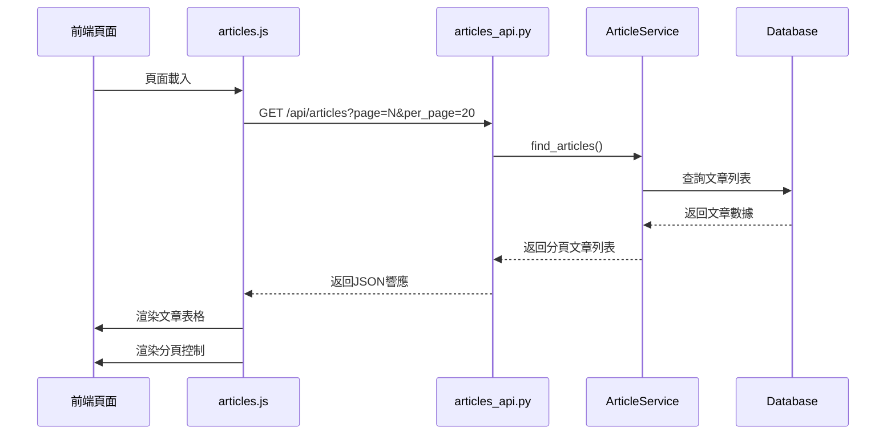

##### 2. 搜尋文章
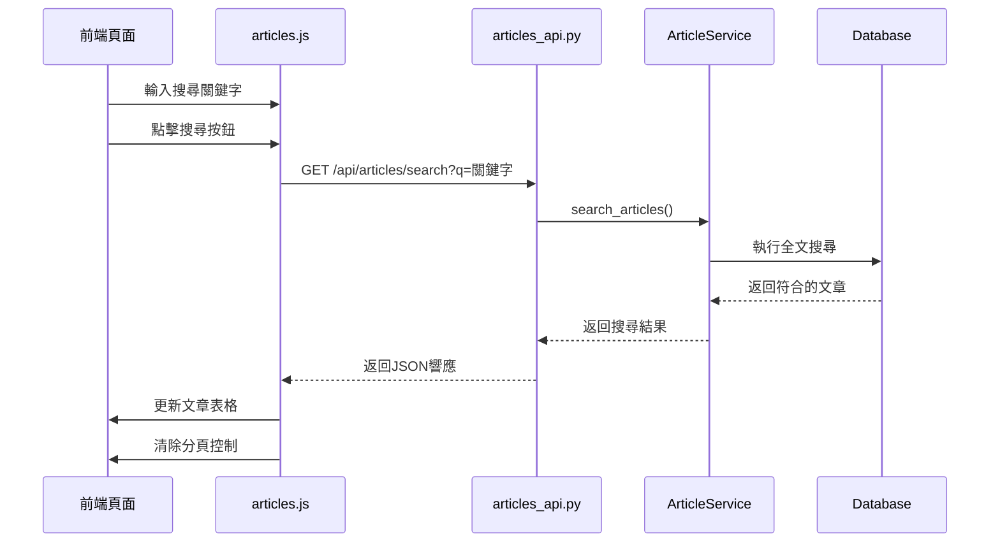

##### 3. 查看文章詳情
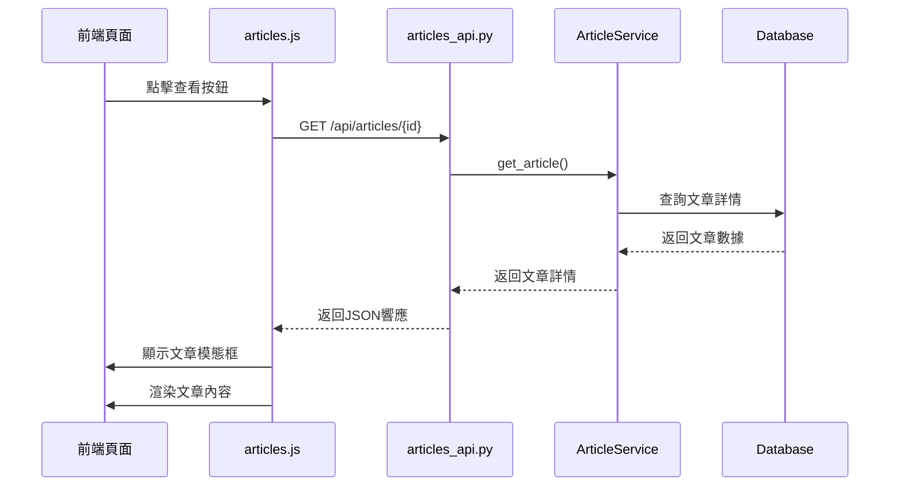

#### 爬蟲管理流程

##### 1. 載入爬蟲列表
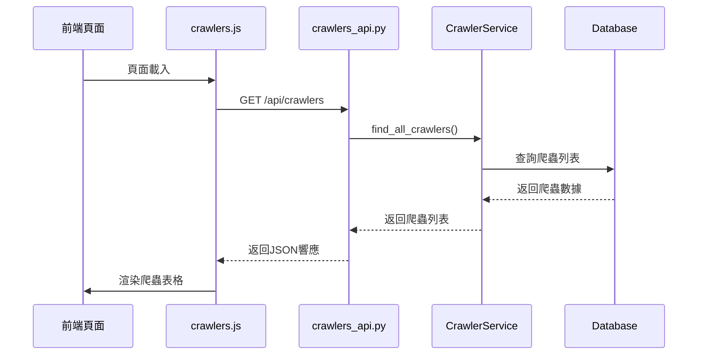

##### 2. 測試爬蟲
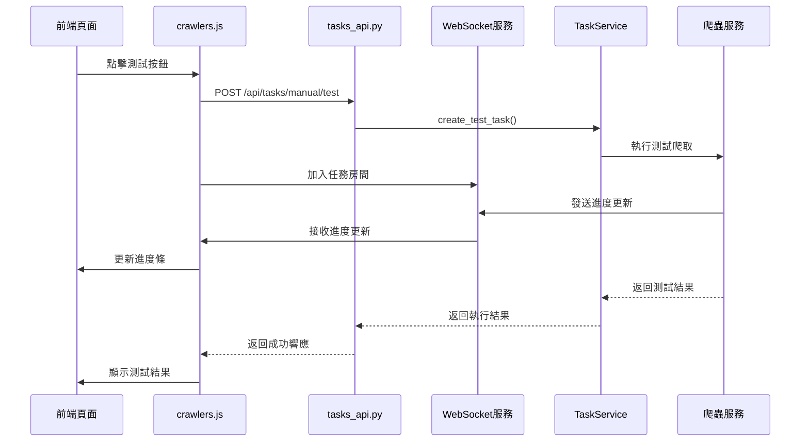

#### 任務管理流程

##### 1. 載入任務列表
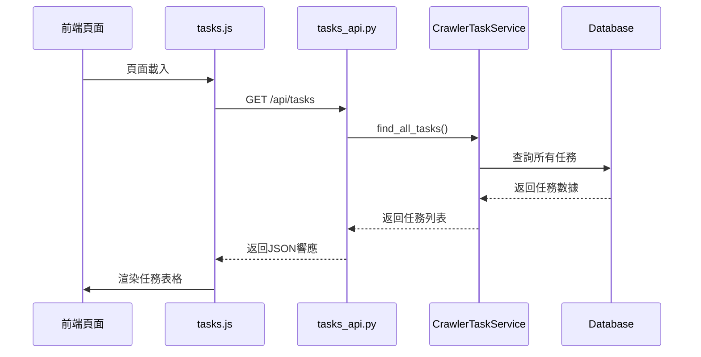

##### 2. 新增任務
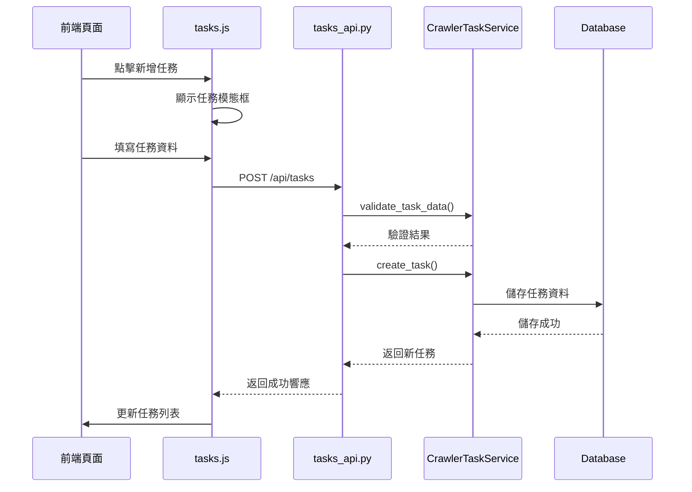

##### 3. 執行任務
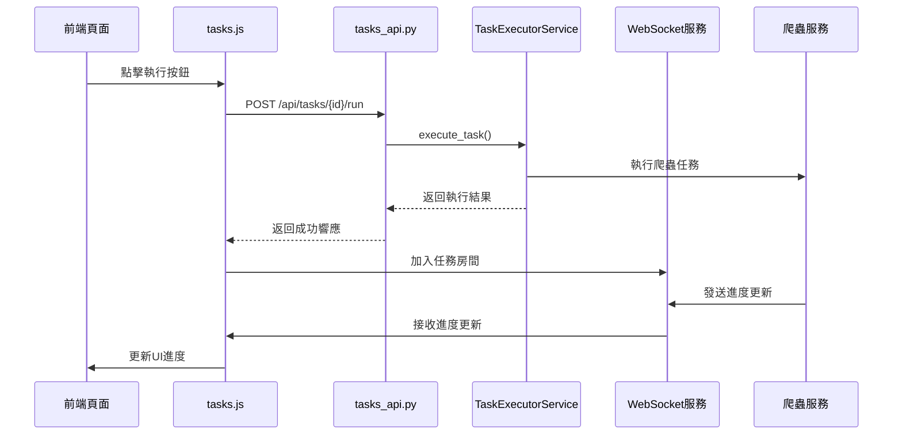

##### 4. 取消任務
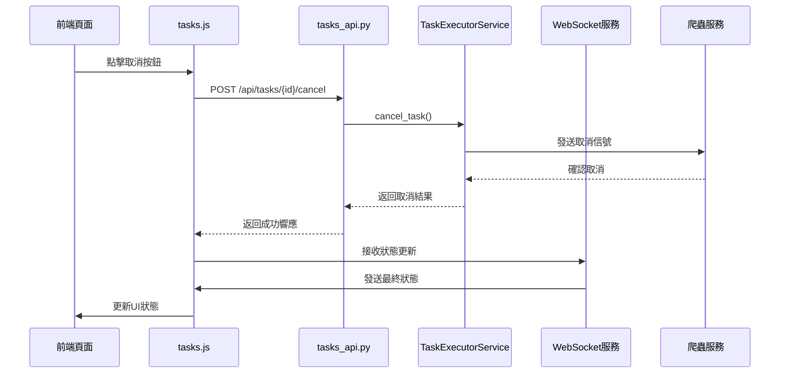

##### 5. 手動爬取連結
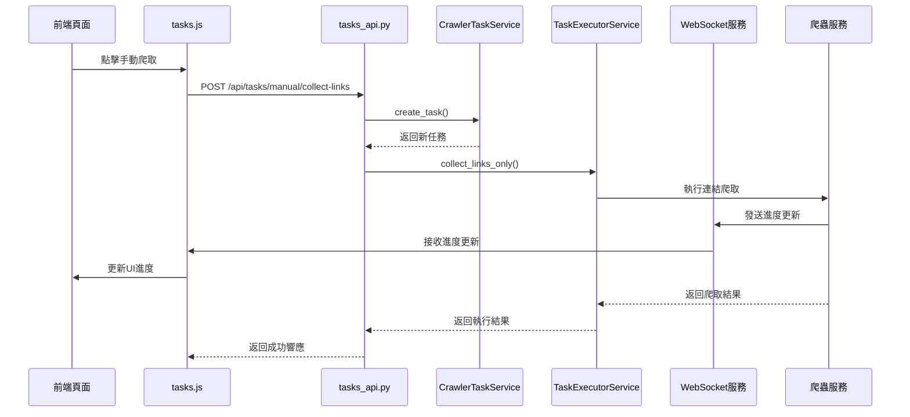

</details>

### API 使用範例

您可以透過 Web UI 或直接呼叫 API 來使用系統。以下是一些基於測試案例的 API 使用範例 (使用 `curl`，假設服務運行在 `localhost:8001`)：

<details>
<summary>點擊展開API使用範例列表</summary>

#### 爬蟲管理 API

1.  **取得所有爬蟲設定:**
    ```bash
    curl -X GET http://localhost:8001/api/crawlers/
    ```

2.  **新增爬蟲設定 (以 Bnext 為例):**
    ```bash
    # 假設 test_bnext_config.json 存在於測試目錄
    curl -X POST -F "crawler_data={'crawler_name': 'Bnext_Test', 'module_name': 'bnext_crawler', 'base_url': 'https://www.bnext.com.tw', 'crawler_type': 'web', 'is_active': true}" -F "config_file=@tests/fixtures/test_bnext_config.json" http://localhost:8001/api/crawlers/
    ```
    *(注意: 上述 `crawler_data` 內的引號可能需要根據您的 shell 環境調整)*

3.  **更新爬蟲設定:**
    ```bash
    curl -X PUT -H "Content-Type: application/json" -d '{"crawler_name": "Bnext_Updated", "is_active": false}' http://localhost:8001/api/crawlers/YOUR_CRAWLER_ID
    ```

4.  **刪除爬蟲設定:**
    ```bash
    curl -X DELETE http://localhost:8001/api/crawlers/YOUR_CRAWLER_ID
    ```

#### 任務管理 API

1.  **創建排程任務:**
    ```bash
    curl -X POST -H "Content-Type: application/json" -d '{"task_name": "Daily Bnext AI News", "crawler_id": YOUR_BNEXT_CRAWLER_ID, "cron_expression": "0 1 * * *", "task_args": {"ai_only": true}}' http://localhost:8001/api/tasks/scheduled
    ```

2.  **啟動手動連結收集任務:**
    ```bash
    curl -X POST -H "Content-Type: application/json" -d '{"crawler_id": YOUR_BNEXT_CRAWLER_ID, "task_args": {"num_articles": 5}}' http://localhost:8001/api/tasks/manual/collect-links
    ```

3.  **獲取手動任務狀態:**
    ```bash
    curl -X GET http://localhost:8001/api/tasks/manual/YOUR_MANUAL_TASK_ID/status
    ```

4.  **為已完成連結收集的任務啟動內容抓取:**
    ```bash
    # 假設從 /links 端點獲取了 target_article_ids
    curl -X POST -H "Content-Type: application/json" -d '{"target_article_ids": [1, 2, 3]}' http://localhost:8001/api/tasks/manual/YOUR_LINK_COLLECTION_TASK_ID/fetch-content
    ```

5.  **取消正在運行的任務:**
    ```bash
    curl -X POST http://localhost:8001/api/tasks/YOUR_TASK_ID/cancel
    ```

#### 文章查詢 API

1.  **獲取文章列表 (分頁/排序):**
    ```bash
    curl -X GET "http://localhost:8001/api/articles/?page=2&per_page=20&sort_by=published_at&sort_desc=true"
    ```

2.  **根據關鍵字搜尋文章:**
    ```bash
    curl -X GET "http://localhost:8001/api/articles/search?q=AI%20應用"
    ```
</details>

## 測試案例

本系統包含完整的測試套件，涵蓋了所有核心功能。測試使用 SQLite memory DB 作為測試資料庫。以下是測試檔案的完整列表：

<details>
<summary>點擊展開測試檔案列表 (`tests/`)</summary>

*   `test_ai_fillter_config.py` - 測試 AI 過濾器配置 (ai_filter_config) 的相關功能。
*   `test_api_utils.py` - 測試 API 請求參數解析工具 (api_utils) 的功能。
*   `test_article_analyzer.py` - 測試 ArticleAnalyzer 類別的功能。
*   `test_article_api_routes.py` - 測試 Article API 相關路由的功能。
*   `test_article_service.py` - 測試 ArticleService 的功能，包括 CRUD、批量操作、搜索、統計、狀態更新和錯誤處理。
*   `test_articles_model.py` - 針對 Articles 相關模型進行單元測試，驗證其資料結構與資料庫互動行為。
*   `test_articles_repository.py` - 測試 ArticlesRepository 的功能，包括 CRUD、搜索、過濾、分頁、批次操作和統計。
*   `test_articles_schema.py` - 測試 ArticleCreateSchema 與 ArticleUpdateSchema 的資料驗證功能。
*   `test_base_config.py` - 測試 src.crawlers.configs.base_config 中的預設設定和輔助函數。
*   `test_base_crawler.py` - 測試 BaseCrawler 類及其相關功能的單元測試。
*   `test_base_model.py` - 測試 Base 模型的功能。
*   `test_base_repository.py` - 測試 BaseRepository 的功能。
*   `test_base_schema.py` - 測試 BaseCreateSchema 與 BaseUpdateSchema 的功能與資料庫互動。
*   `test_base_service.py` - 測試 BaseService 及其相關元件的功能，包括 CRUD、事務管理、錯誤處理和儲存庫互動。
*   `test_bnext_content_extractor.py` - 測試 BnextContentExtractor 的功能。
*   `test_bnext_crawler.py` - 測試 BnextCrawler 類及其相關功能的單元測試。
*   `test_bnext_crawler_config_json.py` - 測試 bnext_crawler_config.json 設定檔的載入、結構和值的正確性。
*   `test_bnext_scraper.py` - 測試 BnextScraper 類別的功能。
*   `test_bnext_utils.py` - 數位時代 (Bnext) 網站爬蟲工具模組的單元測試。
*   `test_crawler_api_routes.py` - 測試爬蟲 API 路由 (/api/crawlers) 的功能。
*   `test_crawler_factory.py` - 測試 CrawlerFactory 的功能。
*   `test_crawler_task_history_model.py` - 測試 CrawlerTaskHistory 模型的功能，包括創建、欄位驗證、時間轉換等。
*   `test_crawler_task_history_repository.py` - 測試 CrawlerTaskHistoryRepository 的功能，包括 CRUD、查找、過濾、統計、狀態更新和錯誤處理。
*   `test_crawler_task_history_schema.py` - 測試 CrawlerTaskHistoryCreateSchema 和 CrawlerTaskHistoryUpdateSchema 的功能，包括欄位驗證和資料轉換。
*   `test_crawler_task_history_service.py` - 測試 CrawlerTaskHistoryService 的功能，涵蓋 CRUD 操作、查詢功能以及錯誤處理等。
*   `test_crawler_task_service.py` - 測試 CrawlerTaskService 的功能，包括 CRUD、任務狀態管理、排程、歷史記錄查詢、重試機制和錯誤處理。
*   `test_crawler_tasks_model.py` - 測試 CrawlerTasks 模型的功能，包括任務創建、欄位驗證、狀態轉換和資料序列化等功能。
*   `test_crawler_tasks_repository.py` - 測試 CrawlerTasksRepository 的功能。
*   `test_crawlers_schema.py` - 測試 Crawlers schema 驗證功能。
*   `test_crawlers_service.py` - 測試 CrawlersService (爬蟲管理服務) 的 CRUD、批量操作、搜尋、狀態切換、統計、配置處理和錯誤處理。
*   `test_database_manager.py` - 測試 src.database.database_manager 模組的功能，包括初始化、健康檢查、事務管理和表創建。
*   `test_datetime_utils.py` - 測試日期時間工具函數 (datetime_utils) 的功能。
*   `test_handle_api_error.py` - 測試 src.error.handle_api_error 中的 API 錯誤處理函數。
*   `test_model_utils.py` - 測試 src.utils.model_utils 中的驗證函數。
*   `test_repository_utils.py` - 測試 src.utils.repository_utils 中的字典更新函數。
</details>


## 佈署指南

本節提供基本的生產環境部署建議。

1.  **伺服器準備:**
    *   準備一台 Linux 伺服器 (建議 Ubuntu 或 CentOS)。
    *   安裝 Docker 和 Docker Compose。
    *   確保防火牆允許目標端口 (例如 80, 443，如果您使用反向代理)。

2.  **取得程式碼:**
    ```bash
    git clone https://github.com/Chengshouyi/AiNewsCollection.git
    cd AiNewsCollection # 將 AiNewsCollection 替換為您的實際倉庫目錄名稱
    ```

3.  **配置 `.env` 文件 (非常重要):**
    *   複製 `.env.example` 為 `.env`。
    *   編輯 `.env` 文件，填寫**安全且唯一**的生產環境配置，特別是：
        *   `POSTGRES_PASSWORD`: 設定強密碼。
        *   `SECRET_KEY`: 設定複雜且隨機的金鑰。
        *   根據需求調整日誌、資料庫名稱等其他設定。
        *   **切勿將 `.env` 文件提交到版本控制系統!**

4.  **啟動服務:**
    ```bash
    # 確保在專案根目錄
    docker-compose -f docker-compose.yml up -d --build --no-cache
    ```
    *   此命令將使用 `docker-compose.yml` (生產配置) 啟動服務。
    *   `--build` 確保使用最新的程式碼和依賴建置映像檔。
    *   `-d` 表示在後台運行。
    *   **資料庫遷移會由 `migrate` 服務自動執行**，`web` 服務會在其成功後才啟動。

5.  **(可選) 手動執行資料庫遷移 (特殊情況):**
    *   正常情況下，部署時遷移會自動進行。如果遇到問題或需要在服務運行後手動執行遷移：
        ```bash
        docker-compose -f docker-compose.yml exec migrate alembic upgrade head
        ```

6.  **(強烈建議) 配置反向代理 (Nginx):**
    *   使用 Nginx 作為反向代理可以提供 HTTPS 加密、負載均衡 (如果需要擴展) 和更方便的端口管理。
    *   **範例 Nginx 配置 (`/etc/nginx/sites-available/ainews`):**
        ```nginx
        server {
            listen 80;
            listen [::]:80;
            server_name your_domain.com www.your_domain.com; # 替換為您的域名

            # (可選) HTTP 重定向到 HTTPS
            location / {
                return 301 https://$host$request_uri;
            }

            # (可選) Certbot ACME challenge 路徑
            location ~ /.well-known/acme-challenge/ {
                allow all;
                root /var/www/html; # 根據 Certbot 設定調整
            }
        }

        server {
            listen 443 ssl http2;
            listen [::]:443 ssl http2;
            server_name your_domain.com www.your_domain.com; # 替換為您的域名

            # SSL 憑證路徑 (使用 Certbot 取得)
            ssl_certificate /etc/letsencrypt/live/your_domain.com/fullchain.pem;
            ssl_certificate_key /etc/letsencrypt/live/your_domain.com/privkey.pem;
            include /etc/letsencrypt/options-ssl-nginx.conf;
            ssl_dhparam /etc/letsencrypt/ssl-dhparams.pem;

            location / {
                proxy_pass http://127.0.0.1:8001; # 將請求轉發到 Docker 容器的 8001 端口
                proxy_set_header Host $host;
                proxy_set_header X-Real-IP $remote_addr;
                proxy_set_header X-Forwarded-For $proxy_add_x_forwarded_for;
                proxy_set_header X-Forwarded-Proto $scheme;

                # WebSocket 支持
                proxy_http_version 1.1;
                proxy_set_header Upgrade $http_upgrade;
                proxy_set_header Connection "upgrade";
                # 增加超時設定 (可選)
                # proxy_connect_timeout 60s;
                # proxy_send_timeout 60s;
                # proxy_read_timeout 60s;
            }
        }
        ```
    *   啟用配置: `sudo ln -s /etc/nginx/sites-available/ainews /etc/nginx/sites-enabled/`
    *   測試配置: `sudo nginx -t`
    *   重載 Nginx: `sudo systemctl reload nginx`
    *   使用 Certbot 獲取 SSL 憑證: `sudo apt install certbot python3-certbot-nginx` (Debian/Ubuntu), 然後 `sudo certbot --nginx -d your_domain.com -d www.your_domain.com`

7.  **訪問:**
    *   如果配置了 Nginx 和 HTTPS，透過 `https://your_domain.com` 訪問。
    *   如果未配置 Nginx (不建議)，透過 `http://YOUR_SERVER_IP:8001` 訪問。

8.  **維護與更新:**
    *   **更新程式碼和依賴:**
        ```bash
        cd AiNewsCollection # 進入專案目錄
        git pull origin main # 或您的主分支
        docker-compose -f docker-compose.yml build # 重建映像檔 (如果 Dockerfile 或依賴有變更)
        # docker pull postgres:15 # 如果需要更新基礎映像檔
        docker-compose -f docker-compose.yml up -d # 重新啟動服務 (會自動執行遷移)
        # docker image prune -f # 清理舊的、未使用的映像檔 (可選)
        ```
    *   **查看日誌:**
        ```bash
        docker-compose -f docker-compose.yml logs -f web # 查看 web 服務的即時日誌
        # docker-compose logs -f worker # 如果有 worker 服務
        docker-compose -f docker-compose.yml logs db # 查看 db 服務日誌
        docker-compose -f docker-compose.yml logs migrate # 查看遷移服務日誌
        ```
    *   **備份資料庫:** 建議定期備份 PostgreSQL 資料庫 volume (`postgres-data`) 或使用 `pg_dump`。

### 如何新增爬蟲

若要擴展系統以支援新的新聞網站，請遵循以下步驟：

1.  **創建爬蟲類別:**
    *   在 `src/crawlers/` 目錄下創建一個新的 Python 檔案，例如 `my_new_crawler.py`。
    *   定義一個新的類別，繼承自 `src.crawlers.base_crawler.BaseCrawler`。
    *   實作必要的抽象方法，至少包含：
        *   `_fetch_article_links(self, task_id: int)`: 抓取目標網站的文章列表頁面，解析出文章標題、連結、發布時間等基本資訊，並返回 Pandas DataFrame。
        *   `_fetch_articles(self, task_id: int)`: 根據 `self.articles_df` 中儲存的連結，逐一或批量抓取文章的完整內容 (作者、內文、標籤等)，並返回包含這些詳細資訊的字典列表。
        *   `_update_config(self)`: 當任務參數更新時，可能需要更新內部使用的爬蟲或擷取器實例的設定。
    *   您可以參考 `src/crawlers/bnext_crawler.py` 作為實作範例，它可能進一步將抓取列表和抓取內容的邏輯分別封裝在不同的輔助類別中 (如 `BnextScraper` 和 `BnextContentExtractor`)。

2.  **設計設定檔 (Config File):**
    *   在電腦任一目錄下創建一個新的 JSON 設定檔，例如 `my_new_crawler_config.json`。
    *   此檔案定義了爬蟲行為所需的參數，例如：
        *   `base_url`: 目標網站的基礎 URL。
        *   `list_url_template`: 文章列表頁面的 URL 模板。
        *   `categories`: 要爬取的網站分類。
        *   `selectors`: 用於從 HTML 中提取特定元素 (如標題、內容、日期) 的 CSS 選擇器。
    *   請參考 `src/crawlers/configs/bnext_crawler_config.json` 的結構和內容。
    *   **注意:** 設定檔的檔案名稱（不含副檔名）將在上傳後被更改為爬蟲的名稱(crawler_name)，這也是爬蟲資料在資料庫中的唯一標識符。

3.  **透過 Web UI 新增爬蟲:**
    *   啟動應用程式並訪問爬蟲管理頁面 (`/crawlers`)。
    *   點擊「新增爬蟲」按鈕。
    *   填寫表單：
        *   **爬蟲名稱 (Crawler Name):** 給您的爬蟲取一個描述性的名稱。
        *   **爬蟲類型 (Crawler Type):** 填寫您在步驟 2 中設定檔的**檔案名稱 (不含 `.json` 副檔名)**，例如 `my_new_crawler`。這將用於系統動態載入對應的爬蟲類別。
        *   **目標站點 (Target Site):** 填寫目標網站的域名，例如 `mynewssite.com`。
        *   **描述 (Description):** (可選) 簡要描述爬蟲。
        *   **設定檔 (Config File):** 上傳您在步驟 2 中創建的 JSON 設定檔。
    *   提交表單。系統會將設定檔儲存到 `/app/data/web_site_configs/` (容器內路徑，對應到 volume 掛載的 `data/web_site_configs` 目錄)。

4.  **測試爬蟲:**
    *   在爬蟲管理頁面找到您新增的爬蟲。
    *   點擊「測試」按鈕。
    *   輸入一個目標網站的文章 URL 進行測試。
    *   觀察 WebSocket 回傳的即時狀態，檢查是否能成功抓取文章內容。
    *   您也可以創建手動任務 (`/tasks` 頁面) 來測試完整的連結抓取和內容抓取流程。

## 貢獻

歡迎各種形式的貢獻！如果您想做出貢獻，請參考以下步驟：

1. Fork 本倉庫。
2. 創建您的特性分支 (`git checkout -b feature/AmazingFeature`)。
3. 提交您的更改 (`git commit -m 'Add some AmazingFeature'`)。
4. 將您的分支推送到遠程倉庫 (`git push origin feature/AmazingFeature`)。
5. 開啟一個 Pull Request。

## 維護者

*   **Chengshouyi** - [GitHub Profile](https://github.com/Chengshouyi)

## 授權條款

本項目採用 MIT 授權條款。詳情請見 [LICENSE](LICENSE) 文件。
